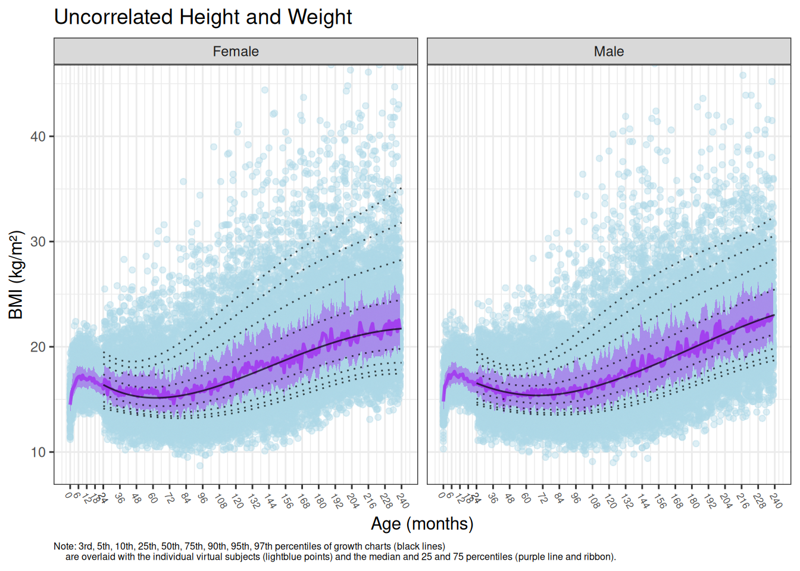

<!-- README.md is generated from README.Rmd. Please edit that file -->

# SimKid

Simulate virtual pediatric subjects using anthropometric growth charts

<!-- badges: start -->

[](https://github.com/Andy00000000000/SimKid/actions/workflows/R-CMD-check.yaml)
[](https://www.codefactor.io/repository/github/andy00000000000/simkid)
[](https://app.codecov.io/gh/Andy00000000000/SimKid?branch=main)
[](https://cran.r-project.org/package=SimKid)
<!-- badges: end -->

## Installation

You can install the development version of SimKid from
[GitHub](https://github.com/) with:

``` r
# install.packages("devtools")
devtools::install_github("Andy00000000000/SimKid")
```

## Example Usage

There are many input options not used in this example. Please refer to
the documentation (`r ?SimKid::sim_kid()`) for descriptions of all
available options.

Simulate 100 virtual subjects per age bin and per sex using CDC growth
charts.

``` r
library(SimKid)
demo0 <- sim_kid(num = 100, agedistr = "nperage", masterseed = 123)
```

Next, allow those virtual subjects to grow for 3 months with monthly
recording of height and weight. Note, this assumes that each subject
remains at the same respective percentiles of height- and
weight-for-age-and-sex as at baseline.

``` r
demo <- grow_kid(data = demo0, grow_time = 3, tstep = 1)
```

Finally, visually validate that the virtual population is reflective of
the CDC growth chart data.

``` r
library(ggplot2)

plots <- validate_kid(data = demo, overlay_percentile = 0.50, alpha = 0.2)

theme_readme <- theme(
  axis.text.x = element_text(size = 6, angle = -60, hjust = -0.1),
  plot.caption = element_text(size = 6)
)

print(plots[[1]]+theme_readme) # height for age by sex
```


``` r
print(plots[[2]]+theme_readme+coord_cartesian(ylim = c(NA, 125))) # weight for age by sex
```


``` r
print(plots[[3]]+theme_readme+coord_cartesian(xlim = c(NA, 125), ylim = c(NA, 45))) # weight for height by sex
```


``` r
print(plots[[4]]+theme_readme+coord_cartesian(ylim = c(NA, 40))) # BMI for age by sex
```


## Getting Help

Please feel free to report problems using the [Issue
Tracker](https://github.com/Andy00000000000/SimKid/issues) or to reach
out for help on the [Discussion
Board](https://github.com/Andy00000000000/SimKid/discussions).

## Citing SimKid

``` r
citation("SimKid")
#> To cite package 'SimKid' in publications use:
#> 
#>   Santulli AR (2025). _SimKid: Simulate Virtual Pediatrics using
#>   Anthropometric Growth Charts_.
#>   <https://github.com/Andy00000000000/SimKid>.
#> 
#> A BibTeX entry for LaTeX users is
#> 
#>   @Manual{,
#>     title = {SimKid: Simulate Virtual Pediatrics using Anthropometric Growth Charts},
#>     author = {Andrew R Santulli},
#>     year = {2025},
#>     url = {https://github.com/Andy00000000000/SimKid},
#>   }
```

## Our Team

[Enhanced Pharmacodynamics, LLC (ePD)](https://www.epd-llc.com/) is a
contract research organization that assists clients with the design and
implementation of model-informed drug development strategies in a broad
range of therapeutic areas. The executive management team is led by
[Dr. Donald E. Mager](https://www.linkedin.com/in/don-mager-2652615/)
and [Dr. Scott A. Van
Wart](https://www.linkedin.com/in/scott-van-wart-2b6002a/).

SimKid was developed at ePD by [Andrew
Santulli](https://www.linkedin.com/in/andrew-santulli-219034156/).

## Abstract Presented at ACoP 2025

**Title:** SimKid: An R package for Simulation of Virtual Pediatric
Subjects

**Authors:** Andrew R Santulli<sup>1</sup>, Sarah F. Cook<sup>1</sup>,
Donald E. Mager<sup>1,2</sup>, Scott Van Wart<sup>1</sup>

**Institutions:** <sup>1</sup>Enhanced Pharmacodynamics, LLC, Buffalo,
NY, USA <sup>2</sup>Department of Pharmaceutical Sciences, School of
Pharmacy and Pharmaceutical Sciences, University at Buffalo, The State
University of New York, Buffalo, NY, USA

**Objective:** Modeling and simulation for pharmacometrics often
requires creation of virtual subjects, with distributions of model
covariates and correlations between them that are reflective of the
clinical trial or overall population characteristics. Body weight or
body surface area (BSA) are commonly statistically significant and
clinically relevant pharmacokinetic model covariates that are used for
dosage calculations, especially during scale-down into pediatric
populations. Creation of representative virtual subjects is paramount to
accurate model-informed drug development when simulating models in
pediatric populations. In this work, anthropometric growth chart
data<sup>1-16</sup> were incorporated into a pharmacometrics-oriented R
package with the goal of facilitating the simulation of virtual
pediatric populations.

**Methods:** Publicly available CDC, WHO, and Fenton growth chart
data<sup>1-16</sup> were collated into a standard format and saved as R
data objects (.rda) for easy use and distribution. For CDC data for ages
2 to 20 years, weight-for-length LMS parameters were unavailable. Where
the LMS parameters are the median (M), generalized coefficient of
variation (S), and power in the Box-Cox transformation (L)<sup>17</sup>.
Therefore, to ensure realistic correlations between weight and height,
the correlation between z-score of height and z-score of weight was
optimized by sex and 1-year age bin using a simulation approach with sum
of squares criteria of fit between simulated and reported percentiles of
BMI-for-age<sup>6</sup>. The LMS parameters for Fenton preterm growth of
weight-for-gestational-age<sup>13,14</sup> were also unavailable and
were fit using a similar approach. The LMS parameters, respective
equations used to obtain height and weight, optimized correlations
between height and weight, and variability in z-scores were incorporated
into an R package that allows for easy and rapid creation of virtual
pediatric subjects. For each simulation, the user can specify the
independent variables, such as the proportion of female subjects, the
assumed distribution of age (uniform or truncated normal), and relevant
age statistics (mean, standard deviation, and range).

**Results:** The SimKid R package can create virtual pediatric subjects
with ages ranging from birth to 20 years. In order to validate that the
virtual populations were reflective of anthropometric growth chart
distributions and correlations, simulated percentiles of weight-for-age,
length-for-age, and weight-for-length (for ages up to 2 years) or
BMI-for-age (for ages greater than 2 years) were overlaid upon the
respective observed percentiles obtained from anthropometric growth
charts<sup>1-16</sup>. Validation figures confirmed that the SimKid
package performed as expected, and a validation module was built into
the package for user convenience and confidence. The package generates a
data frame of virtual subject characteristics that includes age, sex,
weight, height, BMI, and various calculations of BSA.

**Conclusion:** The SimKid R package simulates virtual pediatric subject
demographics that are representative of real-world data based upon
published growth chart data. Use of this R package can help simplify and
potentially standardize the process of simulating virtual pediatric
populations.

**References:**

1.  National Center for Health Statistics. CDC Growth Charts:
    Weight-for-age for Children Birth to 36 Months.
    <https://www.cdc.gov/growthcharts/data/zscore/wtageinf.csv>.
    Accessed April 11, 2025.
2.  National Center for Health Statistics. CDC Growth Charts:
    Length-for-age for Children Birth to 36 Months.
    <https://www.cdc.gov/growthcharts/data/zscore/lenageinf.csv>.
    Accessed April 11, 2025.
3.  National Center for Health Statistics. CDC Growth Charts:
    Weight-for-stature for Children Birth to 36 Months.
    <https://www.cdc.gov/growthcharts/data/zscore/wtstat.csv>. Accessed
    April 11, 2025.
4.  National Center for Health Statistics. CDC Growth Charts:
    Weight-for-age for Children 2 to 20 Years.
    <https://www.cdc.gov/growthcharts/data/zscore/wtage.csv>. Accessed
    April 11, 2025.
5.  National Center for Health Statistics. CDC Growth Charts:
    Stature-for-age for Children 2 to 20 Years.
    <https://www.cdc.gov/growthcharts/data/zscore/statage.csv>. Accessed
    April 11, 2025.
6.  National Center for Health Statistics. CDC Growth Charts:
    BMI-for-age for Children 2 to 20 Years.
    <https://www.cdc.gov/growthcharts/data/zscore/bmiagerev.csv>.
    Accessed April 11, 2025.
7.  National Center for Health Statistics. WHO Growth Charts:
    Weight-for-age for Birth to 24 Months for Boys.
    <https://ftp.cdc.gov/pub/Health_Statistics/NCHS/growthcharts/WHO-Boys-Weight-for-age-Percentiles.csv>.
    Accessed April 11, 2025.
8.  National Center for Health Statistics. WHO Growth Charts:
    Weight-for-age for Birth to 24 Months for Girls.
    <https://ftp.cdc.gov/pub/Health_Statistics/NCHS/growthcharts/WHO-Girls-Weight-for-age%20Percentiles.csv>.
    Accessed April 11, 2025.
9.  National Center for Health Statistics. WHO Growth Charts:
    Length-for-age for Birth to 24 Months for Boys.
    <https://ftp.cdc.gov/pub/Health_Statistics/NCHS/growthcharts/WHO-Boys-Length-for-age-Percentiles.csv>.
    Accessed April 11, 2025.
10. National Center for Health Statistics. WHO Growth Charts:
    Length-for-age for Birth to 24 Months for Girls.
    <https://ftp.cdc.gov/pub/Health_Statistics/NCHS/growthcharts/WHO-Girls-Length-for-age-Percentiles.csv>.
    Accessed April 11, 2025.
11. National Center for Health Statistics. WHO Growth Charts:
    Weight-for-length for Birth to 24 Months for Boys.
    <https://ftp.cdc.gov/pub/Health_Statistics/NCHS/growthcharts/WHO-Boys-Weight-for-length-Percentiles.csv>.
    Accessed April 11, 2025.
12. National Center for Health Statistics. WHO Growth Charts:
    Weight-for-length for Birth to 24 Months for Girls.
    <https://ftp.cdc.gov/pub/Health_Statistics/NCHS/growthcharts/WHO-Girls-Weight-for-length-Percentiles.csv>.
    Accessed April 11, 2025.
13. Fenton 2013 2nd generation Preterm Growth Charts for Boys.
    <https://ucalgary.ca/live-uc-ucalgary-site/sites/default/files/teams/418/fenton2013growthchartcolor-boys.pdf>.
    Accessed April 11, 2025.
14. Fenton 2013 2nd generation Preterm Growth Charts for Girls.
    <https://ucalgary.ca/live-uc-ucalgary-site/sites/default/files/teams/418/fenton2013growthchartcolor-girls.pdf>.
    Accessed April 11, 2025.
15. Fenton TR & Kim JH. A systematic review and meta-analysis to revise
    the Fenton growth chart for preterm infants. BMC Pediatr.
    2013;13:59.
16. Fenton TR, Nasser R, Eliasziw M, Kim JH, Bilan D, Sauve R.
    Validating the weight gain of preterm infants between the reference
    growth curve of the fetus and the term infant. BMC Pediatr.
    2013;13(1):92.
17. National Center for Health Statistics. CDC Growth Charts: Definition
    of LMS parameters.
    <https://www.cdc.gov/growthcharts/cdc-data-files.htm>. Accessed
    April 23, 2025.

## Supplementary Methods

For young ages (birth to 36 months), CDC weight-for-stature growth
charts can be used during simulations to enforce realistic correlations
between height and weight. For later ages, such growth charts are
unavailable. Therefore, to ensure realistic correlations between weight
and height, the correlation between z-score of height and z-score of
weight was optimized by sex and 1-year age bin.

A simulation approach wherein 1000 males and 1000 females per CDC growth
chart age bin (monthly for ages of 25 to 239 months) were created using
the respective CDC LMS parameters. The z-scores for height and weight
were sampled for each virtual subject from a truncated multivariate
normal distribution using `r tmvtnorm::rtmvnorm()` (truncated to a range
of 0.1 to 99.9 percentiles). The correlation used by the truncated
multivariate normal distribution was optimized separately by sex and by
1-year age bin using sum of squares criteria of fit between simulated
and reported percentiles of BMI-for-age (3rd, 10th, 25th, 50th, 75th,
90th, and 97th percentiles). The R `r stats::optimize()` function was
used for the optimization. To reduce the impact of stochastic sampling
from the multivariate normal distributions, the simulation-optimization
procedure was repeated 10 times and the average correlations were
calculated. The optimization codes
(cdc_ages2to20yr_correlations_by_sex_htcm_wtkg_allreplicates.R and
cdc_ages2to20yr_correlations_by_sex_htcm_wtkg_summarized.R) are provided
in the data-raw folder.

The 10x replicate correlations (black) and averaged correlations (red)
are shown below:


The average correlations, by default, are used when simulating virtual
subjects for ages 25 to 239 months. The user can specify
`r age2to20yr_correlate_htwt = FALSE` when calling `r SimKid::sim_kid()`
to avoid using the optimized correlations. This would assume no
correlation between height and weight (ages 25 to 239 months), which is
unrealistic but would not impact subsequent use cases if only weight was
to be utilized.

The below simulations demonstrate the impact of including versus
excluding the height and weight correlations. Note the discrepancy in
simulated versus reported BMI percentiles for ages \>2 years when
simulating without height and weight correlations. Without the height
and weight correlations, there is a discontinuity at 24 months when the
simulation methodology changes away from using CDC weight-for-stature
charts and the lower ribbon of the simulated data extends to the 10th
reported percentile rather than the 25th.

``` r
demo_cor <-   sim_kid(num = 100, agedistr = "nperage", masterseed = 123, age2to20yr_correlate_htwt = TRUE)
demo_nocor <- sim_kid(num = 100, agedistr = "nperage", masterseed = 123, age2to20yr_correlate_htwt = FALSE)

val_cor <-   validate_kid(demo_cor,   overlay_percentile = 0.50)
val_nocor <- validate_kid(demo_nocor, overlay_percentile = 0.50)

print(val_cor[[4]] + labs(title = "Correlated Height and Weight") + theme_readme + coord_cartesian(ylim = c(NA, 45)))
```


``` r
print(val_nocor[[4]]+labs(title = "Uncorrelated Height and Weight")+theme_readme + coord_cartesian(ylim = c(NA, 45)))
```


